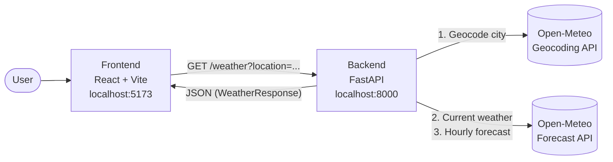
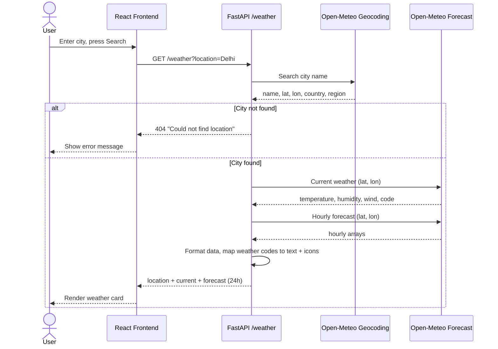
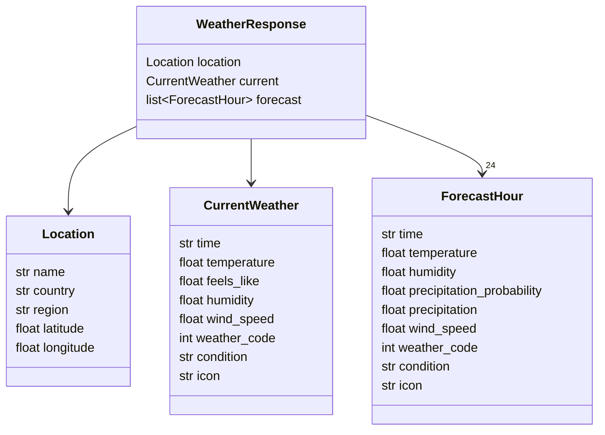

# 🌦️ Sky-Reader (WeatherGPT)

A simple full-stack weather app. Type in a city and get the current conditions plus an hour-by-hour forecast for the next 24 hours.

The **React** frontend talks to a **FastAPI** backend, which fetches and cleans up data from the free [Open-Meteo](https://open-meteo.com/) APIs (no API key required).

## ✨ Features

- 🔍 Search weather by city name (geocoding handled automatically)
- 🌡️ Current temperature, "feels like", humidity and wind speed
- 🕒 Next-24-hours forecast with temperature, rain probability and wind
- ☀️ Weather condition text and emoji icon for every WMO weather code
- ⚠️ Friendly error messages for unknown cities or failed requests
- ✅ Typed, validated API responses using Pydantic

## 🏗️ Architecture



### Request flow



### Response model



## 🧰 Tech Stack

| Layer    | Technology                                   |
| -------- | -------------------------------------------- |
| Frontend | React 19, Vite, plain CSS                    |
| Backend  | Python, FastAPI, httpx (async), Pydantic     |
| Data     | Open-Meteo Geocoding + Forecast APIs         |

## 📁 Project Structure

```
Sky-Reader/
├── backend/
│   ├── main.py                 # FastAPI app, routes, CORS
│   ├── requirements.txt
│   └── weather/
│       ├── service.py          # Geocoding, weather fetching, formatting
│       ├── models.py           # Pydantic response models
│       └── weather_codes.py    # WMO weather code -> condition + emoji
└── frontend/
    ├── index.html
    ├── package.json
    └── src/
        ├── main.jsx
        ├── App.jsx             # Search box + weather UI
        └── App.css
```

## 🚀 Getting Started

### Prerequisites

- Python 3.10+
- Node.js 18+ and npm

### 1. Clone the repo

```bash
git clone https://github.com/TaruneshM/Sky-Reader.git
cd Sky-Reader
```

### 2. Run the backend

```bash
cd backend
python -m venv venv

# macOS / Linux
source venv/bin/activate
# Windows
venv\Scripts\activate

pip install -r requirements.txt
fastapi dev main.py
```

The API runs at **http://127.0.0.1:8000**. Interactive docs are at **http://127.0.0.1:8000/docs**.

### 3. Run the frontend

In a new terminal:

```bash
cd frontend
npm install
npm run dev
```

Open **http://localhost:5173** and search for a city.

## 🔌 API Reference

| Method | Endpoint                | Description                                    |
| ------ | ----------------------- | ---------------------------------------------- |
| GET    | `/`                     | Welcome message                                |
| GET    | `/health`               | Health check                                   |
| GET    | `/weather?location=...` | Current weather and 24h forecast for a city    |

**Example**

```bash
curl "http://127.0.0.1:8000/weather?location=London"
```

```json
{
  "location": { "name": "London", "country": "United Kingdom", "region": "England", "latitude": 51.5, "longitude": -0.12 },
  "current": { "time": "2026-10-01T12:00", "temperature": 15.2, "feels_like": 14.1, "humidity": 72, "wind_speed": 11.5, "weather_code": 3, "condition": "Overcast", "icon": "☁️" },
  "forecast": [ { "time": "2026-10-01T12:00", "temperature": 15.2, "precipitation_probability": 10, "condition": "Overcast", "icon": "☁️", "...": "..." } ]
}
```

**Errors:** `404` if the city can't be found.

## ⚙️ Configuration

- The backend allows CORS from `http://localhost:5173` (see `main.py`).
- The frontend calls the API at `http://127.0.0.1:8000` (see `App.jsx`).

If you deploy the app or change ports, update both places.

## 🗺️ Roadmap

- [ ] AI-powered natural-language weather questions ("Do I need an umbrella today?")
- [ ] Multi-day forecast
- [ ] °C / °F toggle
- [ ] Environment-based config for API URL and CORS origins
- [ ] Tests for the service layer

## 🙏 Acknowledgements

Weather and geocoding data by [Open-Meteo](https://open-meteo.com/).
